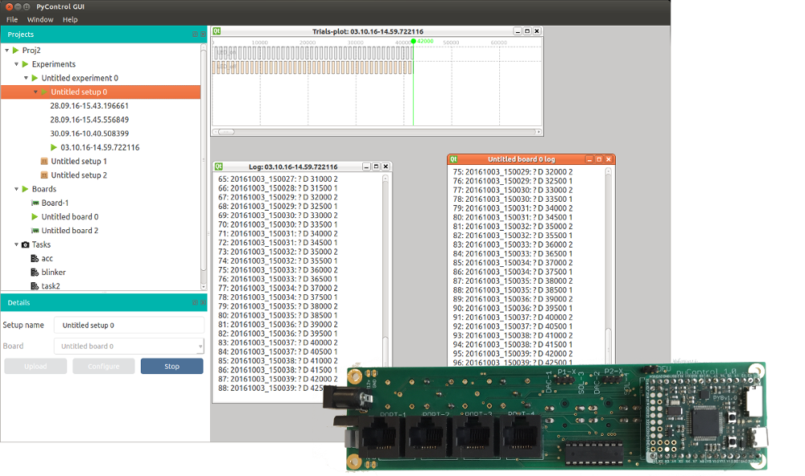

# pyControl

Controlling behavioural experiments using Micropython.

---

## Overview

**pyControl** is a system of software and hardware for controlling behavioural experiments based around the Micropython microcontroller.

---

## Download

**pyControl** is both available as a Graphical User Interface (GUI) and as a Command Line Interface (CLI). 

The GUI is distributed as a standalone executable for Mac and Windows. Source code installation is also possible under Linux.

| Type | Description |
|---|---|
|[pycontrolGUI installer](https://bitbucket.org/fchampalimaud/pycontrol-gui/downloads)| Download binaries for Mac OS and Windows (**recommended**)|
|[Source code installation (GUI)](http://pycontrol-gui.readthedocs.io/en/latest/) | Refer to the pycontrol-gui documentation. |
|[Source code installation (CLI)](http://pycontrol-framework.readthedocs.io/en/latest/) | Refer to the pycontrol-framework documentation. |

## Configuration

Will be implemented soon.

## Developer's guide
Do you want to contribute for the pyControl project? You can find more information [here](/contributing).