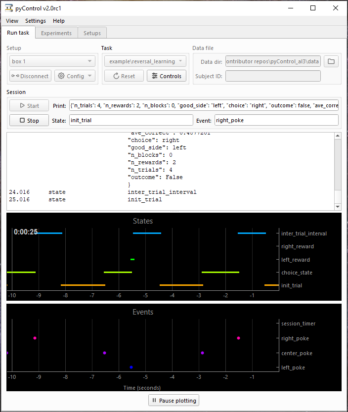

# pyControl

**Open source, Python based, behavioural experiment control.**



## Overview

pyControl is a system of open source hardware and software for controlling behavioural experiments in neuroscience and psychology, built around the [MicroPython](https://micropython.org/) microcontroller.

pyControl makes it easy to program complex behavioural tasks using a clean, intuitive, and flexible syntax for specifying tasks as state machines. User created task definition files, written in Python, run directly on the microcontroller, supported by pyControl framework code.  This gives users the power and simplicity of Python for specifying task behaviour, while allowing low-level access to the microcontroller hardware directly from task code.  For more information see [programming tasks](user-guide/programming-tasks.md).


pyControl [hardware](user-guide/hardware.md) consists of a breakout board and a set of devices such as nose-pokes, audio boards, LED drivers, rotary encoders and stepper motor controllers that are connected to the breakout board to create behavioural setups.  Assembled pyControl hardware is available from the [OpenEphys store](http://www.open-ephys.org/pycontrol) and [Labmaker](https://www.labmaker.org/collections/neuroscience/products/pycontrol-mouse-behaviour-box_set_no1).

pyControl has a [Graphical User Interface](user-guide/graphical-user-interface.md) for controlling experiments and visualing behaviour.

Tools for importing pyControl data into Python for analysis are provided in the [data_import](user-guide/pycontrol-data.md) module.

The pyControl [google group](https://groups.google.com/forum/#!forum/pycontrol) is an email list for pyControl users.

pyControl hardware, software and documentation repositories are on [GitHub](https://github.com/pyControl).

The pyControl [manuscript](https://elifesciences.org/articles/67846) gives a high level overview of the system design and it's rationale and has validation experiments and example use cases.  If you use pyControl in a publication, please cite it.

If you do fiber photometry experiments, you may be interested in pyControl's sister project [pyPhotometry](https://pyphotometry.readthedocs.io).

---

## Getting started

### Installation

Get the latest version of the pyControl GUI, either by downloading it at a zip file from the [releases](https://github.com/pyControl/code/releases) page or by cloning the [code repository](https://github.com/pyControl/code) to your computer with Git.  pyControl is in active development with new versions released from time to time.   The default documentation is for the latest release, but the dropdown menu in the bottom right corner of the docs lets you access documentation for earlier versions, and for the *dev* branch of the code repository where new features are developed.  Cloning the repository is recommended as it makes it easier to update pyControl in the future.

Either way you obtain the code, you will have the following folder structure:

```
- pyControl
    gui                 # Graphical user interface
    com                 # Serial communication and data logging
    config              # Configuration files
    data                # Behavioural data
    experiments         # Experiment definition files
    devices             # Hardware device classes
    pyControl           # pyControl framework
    tasks               # User task definition files
    hardware_defintions # User hardware definition files
    tools               # Tools for importing and visualising pycontrol data
    pyControl_GUI.py    # Python script to launch the GUI
```

### Dependencies

pyControl has the following dependencies:

- Python 3
- pyserial
- numpy
- pyqt5
- pyqtgraph 

 On a Windows machine that does not already have Python installed, the simplest way to install Python is to download an installer from [python.org](https://www.python.org/downloads/). To ensure you can run Python files (including the pyControl GUI) by double-clicking on them, select the options 'Add Python to PATH', 'Add Python to environment variables', and 'Associate files with Python' during installation.  Note; selecting these options when installing Python will cause the Python version you are installing to take precedence over any other version of Python installed on the computer, so may break previous Python based workflows on the computer.

Once you have a working Python 3 installation on the computer, run the windows command prompt (cmd.exe) as an administrator and enter the following commands to install the required packages:

```
python -m pip install numpy
python -m pip install pyserial
python -m pip install pyqt5
python -m pip install pyqtgraph
```

You should then be able to launch the GUI by double-clicking the file *pyControl_GUI.pyw* in the pyControl root directory.  

pyControl has been tested primarily on Windows 10 but in principle should be cross-platform and has been used on Mac and Linux. 

### Updating pyControl

If you installed pyControl by cloning it with git, you can update it by simply pulling the latest version from the code repository.

Alternatively, you can download the latest version from the download page, unzip it, and copy across the *tasks* directory and *config* directory from your old installation to keep your tasks and configuration settings.

Either way, after updating pyControl reload the framework onto your pyboards using the GUI's board config menu.

Get notified of new [releases](about/release-notes.md) by either joining/subscribing to the [pyControl google group](https://groups.google.com/g/pycontrol) or going to the [pyControl code repository](https://github.com/pyControl/code)  and in the upper right corner choosing Watch->Custom->Releases->Apply.

### Running a task

Run the file *pyControl_GUI.py* in the pyControl root directory, you will see a GUI window like that shown above, with the *Run Task* tab selected.

Plug in a pyboard and it will appear in the drop down menu in the *Setup* box.  Select the board and press the *Connect* button.  The GUI will connect to the board.  

If the pyControl framework is not already installed on the board, you will see a message saying *Load pyControl framework using 'Config' button.* Press the *Config* button to bring up the config menu and select *Load framework*.  If you see a message prompting you to disable the pyboard filesystem from acting as a USB flash drive, click *Yes*, then reconnect to the board (the serial port may have changed when you disable the flash drive) and load the framework.

Once the pyControl framework is installed on the board, from the *Tasks* drop down menu, select the task [*blinker*](https://github.com/pyControl/code/blob/master/tasks/example/blinker.py) in the *example* folder.  Press the *Upload* button to upload the task to the pyboard.

Press the *Start* button.  The task will run causing the blue LED on the pyboard to start blinking.

Stop the task with the *Stop* button.

To save data generated by the task to disk, enter a subject ID in the *Subject ID* text box.  The *Start* button will change to *Record* indicating that data from the run will be saved.  Run the task with the *Record* button, a data file will be created in the *pyControl/data* folder.

See the [GUI](user-guide/graphical-user-interface.md) user guide for information on configuring and running experiments on multiple boxes in parrallel.

## Troubleshooting

If you encounter problems take a look at the [troubleshooting](user-guide/troubleshooting.md) page or contact the [google group](https://groups.google.com/forum/#!forum/pycontrol).

## Developer's guide

Do you want to contribute for the pyControl project? You can find more information [here](contributing.md).