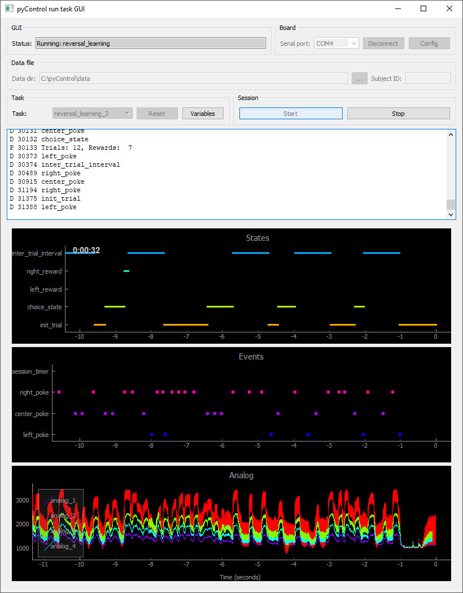

# pyControl GUI

The pyControl GUI provides a graphical interface for running tasks and visualising behaviour.  The GUI is the recommended way of getting started with pyControl, prototyping tasks, testing hardware, and running experiments on individual setups.  The GUI runs a task on a single pyboard at a time, though multiple instances of the GUI can be opened to run tasks on multiple setups in parallel.  For large scale experiments with many setups, the command line interace script [*run_experiment*](command-line-interface#running-experiments) is typically used rather than the GUI.

## Running tasks

Instructions for installing the GUI and running a task can be found in the [getting started](../index.md#getting-started) section.

## Saving data

If a valid data directory and a subject ID are provided, the *Start* button changes to *Record* and the GUI will automatically save data when the framework is run.  

## Configuring variables

The variables dialog, accessed by pressing the *Variables* button is used to set or get the value of task variables.  The variables dialog can be used both before a run starts and while a task is running.  To be edited using the variables dialog, variables must be defined in the task definition file using the `v.my_variable` syntax (see [programming tasks](programming-tasks.md#variables)).

In addition to setting variables with numbers, the variables dialog can be used to set variables to Python objects including strings, lists and dictionaries.

Resetting the task with the *Reset* button returns the task to its intial state as defined in the task definition file.

## Board configuration

The board config menu, accessed by pressing the *Config* button, has the following options:

- *Load framework*: Reload the pyControl framework and device driver files onto the pyboard.

- *Load hardware definition*: Used to load a [hardware definition](hardware.md#hardware-definition) file onto the pyboard.  The selected file is renamed *hardware_definition.py* on the pyboard filesystem irrespective of it's name on the computer.

- *Device Firmware Update (DFU) mode*: Put the pyboard into DFU mode used for upgrading the Micropython firmware.

- *Enable/disable USB flash drive*:  Disabling the USB flash drive prevents the pyboard from showing up on the computers filesystem as a USB storage device. This can be useful if you are connecting a large number of pyboards to a computer and run out of space on the USB bus, as with the flashdrive enabled each pyboard shows up as two USB devices - a flash drive and a USB serial port. pyControl only uses the USB serial port to communicate with the pyboard.