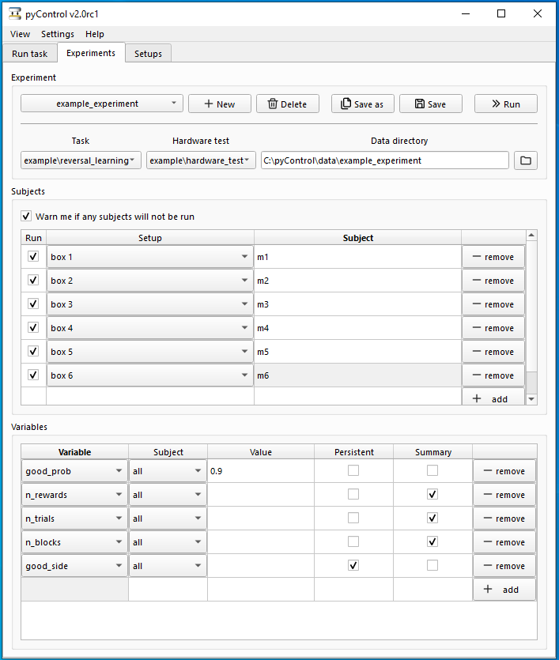

# pyControl GUI

The pyControl GUI is a graphical interface for running experiments, configuring setups and visualising behaviour. The GUI is a tabbed window with *Run task*, *Experiments* and *Setups* tabs.  The *Run task* tab controls one hardware setup at a time i.e. one pyboard and its connected hardware.  It is designed for quickly prototyping tasks and testing hardware setups, but can also be used to acquire data from one setup.  The *Experiments* tab is used to configure and run experiments on many setups in parallel.  The *Setups* tab is used to name and configure the hardware setups connected to the computer.

To run the GUI, run the file *pyControl_GUI.py* in the pyControl root directory.

## Run task tab


The run task tab consists of controls, a log text box and plot panels.  See the [Running a task](../index.md#running-a-task) section of the home page for a step-by-step guide to running a task.  When a task is run the output is printed to the log and the behaviour is plotted.  If a valid data directory and a subject ID are provided, the *Start* button changes to *Record* and the GUI will save the data generated when the task is run.

The **Setup** control box is used to select a pyboard, connect and disconnect from the board, and configure the board.  Pressing the *config* button brings up a menu with options detailed below in the section *Board configuration*.

The **Data file** control box is used to select the directory where data files will be stored and to specify the ID of the subject.  The filename is given by the subject ID and session start date and time.

The **Task** control box is used to select and upload a task and configure task variables.  The tasks available in the drop down menu are those in the folder *pyControl/tasks*.  The tasks folder can be changed using the *Settings* menu.  Tasks can be organised into subfolders within the *tasks* folder, creating a nested list in the GUI drop down menu.  This can be useful if you have a lot of tasks, e.g. to organise them by user.  The *upload* button transfers the task file to the pyboard and sets up the task state machine.  Once a task is uploaded the button changes to *reset*.  Resetting the task returns it to its initial state as defined in the task definition file.  

The *Variables* button opens a dialog for setting or getting the value of task variables.  It can be used either before a run starts or while a task is running.  Variables must be defined in the task definition file using the `v.my_variable` syntax (see [programming tasks](programming-tasks.md#variables)).  Variables can be set to numbers, or to Python objects including strings, lists and dictionaries.  The constants `ms`, `second`, `minute` and `hour` can be used, e.g. a variable can be set to `30*minute`.  You can make task variables invisible to the GUI by ending their name in three underscores (e.g. `v.my_private_variable___`).  Such 'private' variables work as normal in the task file but do not show up in the GUI.  This can be useful if you have a lot of task variables, making it hard to find the ones you need to change in the GUI.

## Experiments tab

The experiments tab is used to configure, save, load and run experiments on one or more hardware setups at the same time.  An experiment is a set of subjects, each with a corresponding hardware setup, run on the same task, with variables optionally set to non-default values for some or all subjects.  When you run an experiment you can run all subjects, or select only a subset to run, and can start and stop different subjects at different times.

### Configuring experiments



When the experiments tab is opened it shows the configure experiment dialog.  To create an experiment, specify the experiment name and select the task.  By default, data generated by the experiment will be saved in a folder *pyControl/data/experiment_name*, but the data folder can be changed using the data dir control.

Optionally a hardware test can be specified for the experiment.  The hardware test is a task that is run before the main task, allowing the user to check whether the hardware is working as intended.  The hardware test can be the same task as that used for the experiment, or another task designed specifically to test the hardware.  No data is saved during the hardware test.

The *Subjects* table is used to specify which subjects will run in which hardware setups.  To add a subject to the experiment, press the *add* button, select the setup and enter a name for the subject.  The *Run* checkbox determines whether on not a particular subject will be run when the experiment is run.  You can assign multiple subjects to the same setup in the variables table but can only run a single subject on a given setup at a time.

The *Variables* table is used to set the value of variables before the task starts.  Variables can be set to the same value for all subjects or to different values for different subjects. Variables can be set to numbers, or Python objects including strings, lists and dictionaries.  The constants `ms`, `second`, `minute` and `hour` can be used, e.g. a variable can be set to `5*second`.  

A variable can be set as persistent by ticking the *persistent* check-box. If a variable is persistent it's value is saved at the end of the session. The next time the experiment is run, if the variable is still set as persistent, its value will be set to the previously stored value.  Persistent variables are saved as a [JSON](https://www.json.org/) object in a file *persistent_variables.json* in the experiments data folder. JSON is a human-readable format so the stored values can be inspected and edited using a text editor.

Summary variables can be specified by ticking the *summary* check-box. The values of summary variables are displayed for each subject at the end of the session and copied to the clipboard in a format that can be pasted directly into spreadsheets or text editors. The values of each subject's summary variables at the end of the session are also written to that subjects data file.

The *save* button saves the current experiment configuration.  Saved experiments can be loaded by selecting them with the drop down menu. Saved experiments can be deleted with the delete button.  Each experiment is saved as a separate file in the folder *pyControl/experiments*.  Experiment configurations are saved as JSON objects in text files with a *.pcx* file extension.

### Running experiments

To run an experiment, press the *Run* button on the configure experiments tab.  This changes the experiments tab from the configure experiment interface to a run experiment interface:


The GUI will connect to the setups and upload the task. Once the task is loaded on all the boards the *Start all* button and *Start* buttons for individual subjects will become available.

While the experiment is running, data from each setup is shown in a separate box.  This shows the current state, the most recent event, the most recent line printed, and a log of output generated by the task. The variables button brings up a dialog to set or get the value of task variables for that subject.

The *Hide logs* button hides the log textboxes for all subjects, leaving the summary data (current state, most recent event and print) and buttons, to fit more setups on screen simultaneously.

The *Show plots* button opens a tabbed window where the behaviour of each subject can be visualised.  Plots for each subject can be popped out into separate windows by dragging or double-clicking their tab.


## Setups tab

The setups tab is used to name and configure hardware setups.


If a name is specified for a setup, the name will appear instead of the setups serial port in the board select drop down menu in the *Run task* and *Configure experiment* tabs.

The configure button next to each setup bring up a menu of configuration options for that board.  Alternatively multiple boards can be selected with the checkboxes and configured with the *configure selected* buttons.

## Board configuration

The board configuration menu has the following options to configure pyboards.

- *Load framework:* Reload the pyControl framework and pyControl device driver files onto the pyboard.
- *Load hardware definition:* Load a [hardware definition](hardware.md#hardware-definition) file onto the pyboard.  The selected file is renamed *hardware_definition.py* on the pyboard filesystem irrespective of it's name on the computer, so the hardware definition is always imported into the task file with:

```python
import hardware_definition as hw
```
- *Device Firmware Update (DFU) mode:* Put the pyboard into DFU mode used for upgrading the version of MicroPython running on the board.  For more information on upgrading MicroPython see [here](http://micropython.org/download).
- *Enable/disable USB flash drive:*  Disabling the USB flash drive prevents the pyboard from showing up on the computer's filesystem as a USB storage device. This can be useful if you are connecting a large number of pyboards to a computer and run out of space on the USB bus. With the flashdrive enabled each pyboard shows up as two USB devices - a flash drive and a USB serial port.