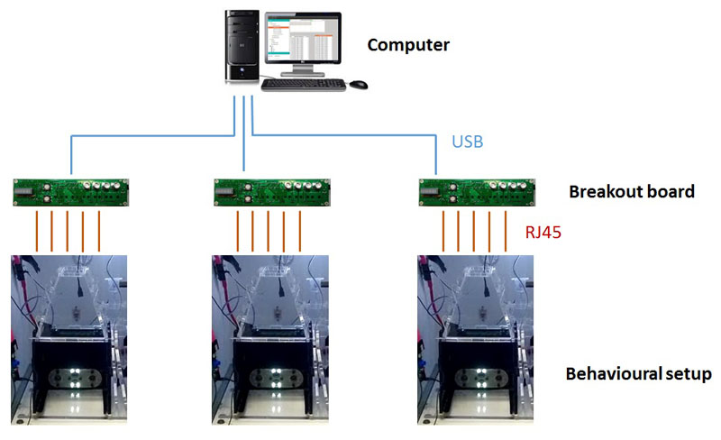
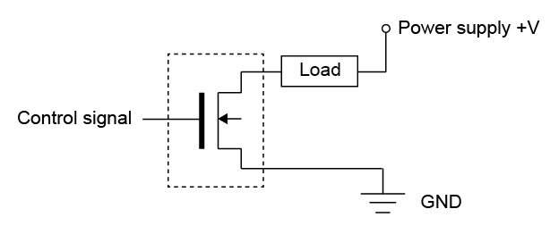
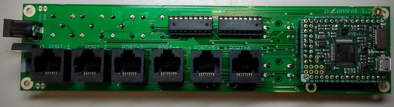
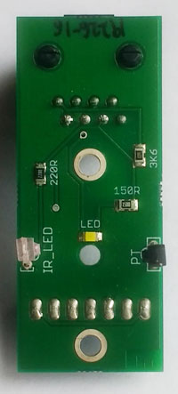
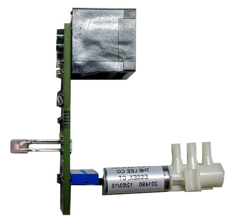
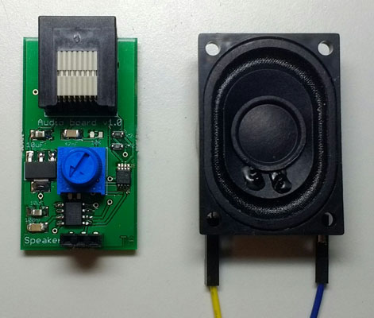
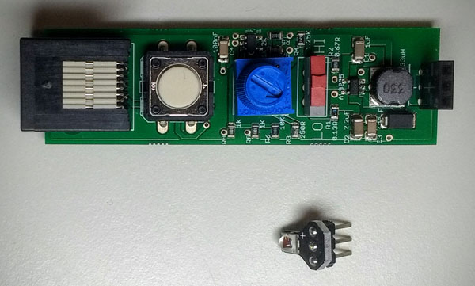

# Hardware

## Overview

A typical pyControl hardware setup consists of one or more breakout boards connected to a computer by USB, each of which runs a single behavioural setup.  The breakout board connects to a set of devices such as nosepokes, audio boards and LED drivers which make up the behavioural setup.



## Hardware definitions

Hardware objects can be instantiated directly in a state machine definition file (as in the [button](https://bitbucket.org/takam/pycontrol/src/default/tasks/button.py) example), however the recomended way of specifying hardware is to create a *hardware definition* file which is imported by the state machine.  The rationale for this is twofold: Firstly, the same hardware setup is  typically used for many different tasks so seperating out the hardware and task definition code into seperate files avoids repeating the hardware definition in each task file.  Secondly, the same task may be used on different setups without modifying the task code as long as the required hardware devices are 
specified in the hardware definition.

The hardware definition tells the pyControl system what inputs and outputs are available for use by state machines.  A simple hardware definition file might read:


```python
from devices import *   

button = Digital_input(pin='X1', rising_event='button_press')
LED    = Digital_output(pin='X2')
```

This specifies that there is a digital input called `button` connected to pin X1 on the pyboard, and a digital output called `LED` connected to pin X2.  Each time a rising edge occurs on pin X1, a framework event named `'button_press'` will be generated, you can also specify events to be generated when falling edges occur on digital inputs:


```python
button = Digital_input(pin='X1', rising_event='button_press', falling_event='button_release')
```

By convention the hardware definition file is imported into state machine definitions with:

```python
import hardware_definition as hw
```

such that hardware objects are accessed in the state machine definition as in the examples below:


```python
hw.button.value() # Read the state of the button.

hw.LED.on()      # Turn the LED on

hw.LED.off()     # Turn the LED off
```

You can turn off all outputs (for example at the end of a session) using the command:


```python
hw.off()  # Turn off all outputs.
```

### Behaviour ports

Typically when pyControl is used to run a behavioural experiment, the micropython board is mounted on a [breakout board](#breakout-boards) which provides a set of *behaviour ports* which hardware like nose pokes or levers are connected to.  

Each port is an 8 pin RJ45 connector which provides power (GND, 5V and 12V), two general purpose digital input/output (DIO) lines, and two driver lines which can be used for switching higher power loads such as solenoids or LEDs. pyControl hardware uses standard network cables for connecting hardware devices to the breakout board as they are cheap, readily available and reliable.

The DIO lines connect directly to pins on the micropython microcontroller. The microcontroller uses 3.3V logic so when these pins are used as outputs they switch from 0 to 3.3V in the off and on states respectively. The DIO lines are 5V tolerant and can recieve 5V logic signals as inputs.

The driver lines are low side drivers ([datasheet](https://toshiba.semicon-storage.com/info/docget.jsp?did=29893)) which connect the negative side of the load to ground when turned on:



The positive side of the load can be connected to any voltage up to 12V.  Each driver line can sink up to 150mA of current. Putting more current through the driver lines can damage the driver IC, and in extreme cases could pose a fire risk.  The driver ICs are mounted in sockets and can be easily replaced if damaged.

Some ports have additional functionality such as an extra driver line, digital to analog (DAC), analog to digital (ADC) or serial communication (I2C/UART).

Typically devices which plug into a behaviour port have several inputs and outputs, for example the [poke](#poke) device comprises an IR beam, stimulus LED and solenoid output. Rather than having to specify each input and output on a hardware device seperately, each device has its own Python class, allowing it to be instantiated with a single command.  For example the hardware definition below specifies that 3 nose pokes are plugged into ports 1-3 of pyControl Breakout board 1.2.

```python
from devices import *

board = Breakout_1_2()  # Instantiate the breakout board object.

# Instantiate the poke objects.
left_poke   = Poke(port=board.port_1, rising_event='left_poke'  , falling_event='left_poke_out' )
centre_poke = Poke(port=board.port_2, rising_event='centre_poke', falling_event='centre_poke_out')
right_poke  = Poke(port=board.port_3, rising_event='right_poke' , falling_event='right_poke_out')
```

When a Poke object is instantiated, it creates a digital input which will generate the specified rising and falling events when the pokes IR beam is broken, and two digital outpts corresponding to the LED and solenoid.  These can be controlled from within a state machine definition as:


```python
hw.left_poke.LED.on() # Turn on the LED on the left poke.

hw.right_poke.SOL.off() # Turn off the solenoid on the right poke.
```

# Hardware classes

The following sections detail the Python classes used to specify and control pyControl hardware.

## Inputs and outputs

These classes control the behaviour of a single pin on the micropython.  See also the micropython [pyb](https://docs.micropython.org/en/latest/pyboard/library/pyb.html) module.

---

### Digital input

The digital input class generates pyControl framework events when a specified pin on the Micropython board changes state. Seperate events can be specified for rising and falling edges. 

By defalt debouncing is used to prevent multiple events being triggered very close together in time if the edges are not clean.  The debouncing method used ensures that transient inputs shorter than the debounce duration still generate rising and faling edges.  Debouncing incurs some overheads so should be turned off for inputs with clean edges and high event rates.

Setting the decimate argument to an integer N causes only every N'th input pulse to generate an event.  Input pulses that are ignored due to decimation incur minimal overheads.  Decimation is designed for inputs like camera sync pulses where the input occurs at a high rate and recording 1 out of every N pulses is sufficent. Decimate can be used only with debouncing off and an event specified for a single edge.  

```python
class Digital_input(pin, rising_event=None, falling_event=None, debounce=5, decimate=False, pull=None)
```

*Arguments:*

`pin` Micropython pin to use

`rising_event` Name of event triggered on rising edges.

`falling_event` Name of event triggered on falling edges.

`debounce` Minimum time interval between events (ms), set to False to deactive debouncing.

`decimate` Set to N to only generate 1 event for every N input pulses.

`pull` Set to `'up'` or `'down'` to enable internal pullup or pulldown resistor.

*Methods:*

`Digital_input.value()`  Get the current state of the input, returns True if pin is high, False if low.

---

### Digital output

The digital output class is used to control a pyboard pin used as a digital output.

```python
class Digital_output(pin, inverted=False, pulse_enabled=False)
```

*Arguments:*

`pin` Micropython pin to use.

`inverted` If `True`, the pin voltage is set high when the input is turned off and low when turned on.

`pulse_enabled` Set to `True` to enable squarewave pulsed output using the `pulse` method.  Pulsed output uses one of the pyboard hardware timers and as there are a limited number of these pulsed output is by default disabled.

*Methods:*

`Digital_output.on()` Turn on output.

`Digital_output.off()` Turn off output.

`Digital_output.toggle()` Toggle output.

`Digital_output.pulse(freq)` Turn on squarewave output with specified frequency.

`Digital_output.enable_pulse()` Setup output to support pulsed output.

---

## Breakout boards

Breakout boards interface the micropython board with RJ45 behaviour ports, BNC connectors, indicator LEDs and user pushbuttons.  The breakout board classes specify the pin mappings for the boards.

---

**Breakout 1.2**

Current version of the pyControl Breakout board with 6 RJ45 behaviour ports, 4 BNC connectors, indicator LEDs and user pushbutton. 

[Schematic (pdf)](../media/hardware/breakout-1-2-sch.pdf) 

**Front:**

**Back:**


```python
class Breakout_1_2()
```

*Atributes:*

`Breakout_1_2.port_1`, ... , `Breakout_1_2.port_6`  

`Breakout_1_2.BNC_1`, `Breakout_1_2.BNC_2`

`Breakout_1_2.DAC_1`, `Breakout_1_2.DAC_2`

`Breakout_1_2.button`

*Example usage:*

```python
# Instantiate breakout board object.
board = Breakout_1_2()

# Instantiate poke connected to port 1.
left_poke = Poke(port=board.port_1, rising_event='left_poke') 

# Instantiate digital output connected to BNC_1.
BNC_output = Digital_output(pin=board.BNC_1) 

# Instantiate digital input connected to BNC_2.
BNC_input  = Digital_input(pin=board.BNC_2, rising_event='BNC_input') 

# Instantiate pushbutton input, need to enable pullup resistor to use pushbutton.
pushbutton = Digital_input(pin=board.button, falling_event='button', pull='up') 
``` 

---

**Breakout 1.0**

Older version of the Breakout board with 4 RJ45 behaviour ports, 4 BNC connectors, indicator LEDs and two user pushbuttons.

[Schematic (pdf)](../media/hardware/breakout-1-0-sch.pdf) 

```python
class Breakout_1_0()
```

*Atributes:*

`Breakout_1_2.port_1`, ... , `Breakout_1_2.port_4`  

`Breakout_1_2.BNC_1`, `Breakout_1_2.BNC_2`

`Breakout_1_2.DAC_1`, `Breakout_1_2.DAC_2`

`Breakout_1_2.button_1` , `Breakout_1_2.button_1`

---

## Devices

### Poke

Nosepoke port with infra-red beam, stimulus LED and socket to connect solenoid valve.

[Schematic (pdf)](../media/hardware/poke-2-3-sch.pdf) 

|**Front**|**Side - solenoid attached**|
|---|---|
||

Mounted Front


Mounted Back


```python
class Poke(port, rising_event=None, falling_event=None, debounce=5)
```

*Arguments:*

`rising_event` Name of event triggered on IR beam break.

`falling_event` Name of event triggered on IR beam make.

`debounce` Minimum time interval between events (ms), set to False to deactive debouncing.

*Attributes:*

`Poke.LED` Stimulus LED

`POKE.SOL` Solenoid output.

*Methods:*

`Poke.value()` Returns `True` is beam is broken, `False` otherwise.

*Example usage:*

```python

# Instantiate poke object and specify event names.
left_poke = Poke(port=board.port_1, rising_event='left_poke', 'left_poke_out') 

left_poke.LED.on() # Turn on the stimulus LED.

left_poke.SOL.off() # Turn off the solenoid.
```

---

### Audio board

Audio amplifier board for driving a speaker to produce auditory stimuli.  The board uses the micropython [DAC](https://docs.micropython.org/en/latest/pyboard/library/pyb.DAC.html) for stimulus generation.  The audio board must be plugged into a port on the breakout board which supports DAC output and I2C serial communication (used to set the volume) - ports 3 and 4 on breakout board 1.2 are suitable.  Up to two audio boards can be used with a single breakout board allowing two speakers to be driven independently.

[Schematic (pdf)](../media/hardware/audio-board-1-0-sch.pdf) 



```python 
class Audio_board(port)
```

*Methods:*

`Audio_board.set_volume(V)` Set volume of audio output, range 0 - 127.

`Audio_board.off()` Turn off audio output.

`Audio_board.sine(freq)` Play a sine wave at the specified frequency.

`Audio_board.square(freq)` Play a square wave at the specified frequency.

`Audio_board.noise(freq=10000)` Play white(ish) noise with specified maximum frequency.

`Audio_board.click()` Play a single click.

`Audio_board.clicks(rate)` Play clicks at specified rate.

`Audio_board.pulsed_sine(freq, pulse_rate)` 

Play a sine wave of the specified frequency pulsed with a 50% duty cycle at the specified rate.

`Audio_board.pulsed_square(freq, pulse_rate)`

Play a square wave of the specified frequency pulsed with a 50% duty cycle at the specified rate.

`Audio_board.pulsed_noise(freq, pulse_rate)` 

Play white(ish) noise with specified maximum frequency pulsed with a 50% duty cycle at the specified rate.

`Audio_board.stepped_sine(start_freq, end_freq, n_steps, step_rate)`

Play a series of sine waves whose frequency is stepped from `start_freq` to `end_freq` in `n_steps` steps at the specifed step rate.

`Audio_board.stepped_square(start_freq, end_freq, n_steps, step_rate)`

Play a series of square waves whose frequency is stepped from `start_freq` to `end_freq` in `n_steps` steps at the specifed step rate.

`Audio_board.play_wav(self, file_name, gc_collect=True)`

Play audio from specified .wav file.  File must be a mono 8 bit wav.  RAM limitations mean that only short .wav files can be played.
By default a garbage collection is performed after playing the file to free up the memory used to load it, this can be disabled by setting the 
gc_collect argument to False. 

*Example usage:*

```python
speaker = Audio_board(board.port_3) # Instantiate audio board.

speaker.sine(5000) # Play a 5KHz sine wave.

speaker.noise() # Turn on white noise.

speaker.off() # Turn off sound output.
```

---

### LED driver

A constant current LED driver for optogenetic stimulation.

[Schematic (pdf)](../media/hardware/LED-driver-1-1-sch.pdf) 



```python 
class LED_driver(port)
```

*Methods:*

`LED_driver.on()` Turn on LED

`LED_driver.off()` Turn off LED