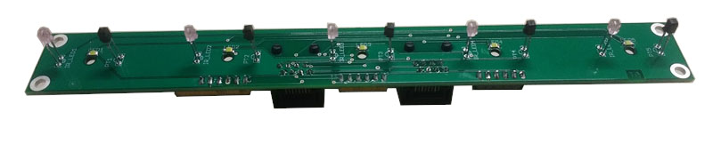

# Hardware


## Overview

A typical pyControl hardware setup consists of one or more breakout boards connected to a computer by USB, each of which runs a single behavioural setup.  The breakout board connects to a set of devices such as nosepokes, audio boards and LED drivers which make up the setup. USB hubs can be used between the computer and breakout boards such that many setups can be controlled from a single computer.

All pyControl hardware is open source and design files for the hardware detailed below are available in the [pyControl hardware repository](https://github.com/ThomasAkam/pyControl_hardware).  In addition to pyControl electronics, the repository has designs for a [behaviour box](https://github.com/ThomasAkam/pyControl_hardware/tree/master/Behaviour_box_small) and [sound attenuating chamber](https://github.com/ThomasAkam/pyControl_hardware/tree/master/Sound_attenuating_chamber_small), and a list of [useful parts](https://github.com/ThomasAkam/pyControl_hardware/blob/master/useful-parts-list.md) such as cables, solenoids, mounting hardware etc for building setups.  Assembled pyControl hardware is available from the [OpenEphys store](http://www.open-ephys.org/pycontrol).

For information about synchronising pyControl with other hardware such as electrophysiology or video cameras see the [synchronisation](synchronisation.md) user guide.

## Safety

As electronic devices pyControl hardware could pose a fire risk if used inappropriately.

- All boards should be securely mounted using M3 bolts and insulating spacers to prevent short circuits due to contact with metal objects. 

- Power down hardware when not in use.

- When connecting external devices consider the amount of current they will draw.  See the [Breakout boards](hardware.md#breakout-boards) section below for more information.

## Hardware definitions

Hardware objects can be instantiated directly in a state machine definition file (as in the [button](https://bitbucket.org/takam/pycontrol/src/default/tasks/button.py) example), however the recomended way of specifying hardware is to create a *hardware definition* file which is imported by the state machine.  The rationale for this is twofold: Firstly, the same hardware setup is  typically used for many different tasks so seperating out the hardware and task definition code into seperate files avoids repeating the hardware definition in each task file.  Secondly, the same task may be used on different setups without modifying the task code as long as the required hardware devices are specified in the setup's hardware definitions.

The hardware definition tells the pyControl system what inputs and outputs are available for use by state machines.  A simple hardware definition file might read:


```python
from devices import *   

button = Digital_input(pin='X1', rising_event='button_press')
LED    = Digital_output(pin='X2')
```

This specifies that there is a digital input called `button` connected to pin X1 on the pyboard, and a digital output called `LED` connected to pin X2.  Each time a rising edge occurs on pin X1, a framework event named `'button_press'` will be generated, you can also specify events to be generated when falling edges occur on digital inputs:


```python
button = Digital_input(pin='X1', rising_event='button_press', falling_event='button_release')
```

By convention the hardware definition file is imported into state machine definitions with:

```python
import hardware_definition as hw
```

such that hardware objects are accessed in the state machine definition as in the examples below:


```python
hw.button.value() # Read the state of the button.

hw.LED.on()      # Turn the LED on

hw.LED.off()     # Turn the LED off
```

You can turn off all outputs (for example at the end of a session) using the command:


```python
hw.off()  # Turn off all outputs.
```

# Inputs and outputs

The following hardware classes control the behaviour of a single pin on the micropython microcontroller.

---

## Digital input

The digital input class generates pyControl framework events when a specified pin on the Micropython board changes state. Seperate events can be specified for rising and falling edges. 

By defalt debouncing is used to prevent multiple events being triggered very close together in time if the edges are not clean.  The debouncing method used ensures that transient inputs shorter than the debounce duration still generate rising and faling edges.  Debouncing incurs some overheads so should be turned off for inputs with clean edges and high event rates.

Setting the decimate argument to an integer N causes only every N'th input pulse to generate an event.  Input pulses that are ignored due to decimation incur minimal overheads.  Decimation is designed for inputs like camera sync pulses where the input occurs at a high rate and recording 1 out of every N pulses is sufficent. Decimate can be used only with debouncing off and an event specified for a single edge.  

```python
class Digital_input(pin, rising_event=None, falling_event=None, debounce=5, decimate=False, pull=None)
```

*Arguments:*

`pin` Micropython pin to use

`rising_event` Name of event triggered on rising edges.

`falling_event` Name of event triggered on falling edges.

`debounce` Minimum time interval between events (ms), set to False to deactive debouncing.

`decimate` Set to N to only generate 1 event for every N input pulses.

`pull` Set to `'up'` or `'down'` to enable internal pullup or pulldown resistor.

*Methods:*

`Digital_input.value()`  Get the current state of the input, returns True if pin is high, False if low.

---

## Analog input

The analog input class measures the voltage on a pin at a specified sampling rate, can stream these measurements to the host computer to be saved to disk, and can generate pyControl framework events when the voltage rises above or falls below a specified threshold.  

The input voltage is measured with 12 bit resolution giving a number between 0 and 4095, corresponding to the voltage range 0 to 3.3V relative to the pyboard ground.

Acquiring analog data and streaming it to the host computer uses pyboard processor and communication resources so attempting to acquire at too high sampling rates or from too many inputs simultaneously will overload the board. The maximum achievable sample rates have not been extensively tested, though six analog inputs aquiring at 1KHz each appears to work.


```python
class Analog_input(pin, name, sampling_rate, threshold=None, rising_event=None, falling_event=None)
```

*Arguments:*

`pin` Micropython pin to use. Only a subset of micropython pins support analog to digital conversion (ADC) (see pyboard [quickref](https://docs.micropython.org/en/latest/pyboard/pyboard/quickref.html)).

`name` Name of the analog input, used to identify data files generated when input is recorded.

`sampling_rate` The rate at which the pin voltage is sampled (Hz). 

`threshold` Threshold against which voltage samples are compared for generating rising and falling events, must be an integer between 0 and 4095.

`rising_event` Name of event triggered when voltage crosses threshold in rising direction.

`falling_event` Name of event triggered when voltage crosses threshold in falling direction.

*Methods:*

`Analog_input.record()`  Start streaming analog input measurements to computer.  If the computer is logging pyControl data the analog data will be saved to disk.  Analog data is saved in seperate files from the main pyControl data log, with a seperate data file for each analog input.  Analog data is saved in binary files with a *.pca* file extension, for information on how to read these files see [pyControl data](pycontrol-data.md#analog-data).

`Analog_input.stop()`  Stop streaming analog data to computer.  You can start and stop streaming analog data multples times in a framework run.  If rising or falling events are specified for the analog input these will be generated regardless of whether or not the input is streaming data to the computer.

---

## Digital output

The digital output class is used to control a pyboard pin used as a digital output.

```python
class Digital_output(pin, inverted=False, pulse_enabled=False)
```

*Arguments:*

`pin` Micropython pin to use.

`inverted` If `True`, the pin voltage is set high when the input is turned off and low when turned on.

`pulse_enabled` Set to `True` to enable squarewave pulsed output using the `pulse` method.  Pulsed output uses one of the pyboard hardware timers and as there are a limited number of these pulsed output is by default disabled.

*Methods:*

`Digital_output.on()` Turn on output.

`Digital_output.off()` Turn off output.

`Digital_output.toggle()` Toggle output.

`Digital_output.pulse(freq, duty_cycle=50, n_pulses=False)` Turn on a pulse train with specified frequency (Hz). The duty cycle (percentage of the period for which the signal is high) can be specified as 10, 25, 50 or 75.  If the n_pulses argument is set to an integer the pulse train will stop after this number of pulses has been delivered.

`Digital_output.enable_pulse()` Setup output to support pulsed output.

---

## Breakout boards

Typically when pyControl is used to run a behavioural experiment, the micropython microcontroller is mounted on a breakout board, which interfaces it with *behaviour ports*, BNC connectors, indicator LEDs and user pushbuttons. 

> #### !!! Electrical safety !!!
> When connecting devices to breakout boards it is important to consider the amount of current they will draw.  Several components limit the maximum current that can safely be drawn: 
> 
> - The driver ICs on driver lines (see below) can sink up to 150mA per driver line.
> - Cat 5 network cable (used to connect devices to behaviour ports) can carry up to 0.6A per conductor.  The maximum current that can safely be drawn in total from the 12V and 5V lines on the behaviour port is 0.6A as all the current returns via the ground line.
> - The voltage regulator on the breakout board that powers the behaviour port 5V lines can source aproximately 300mA of current, which is shared by the 5V lines on all behaviour ports.  

### Behaviour ports

Each behaviour port is an 8 pin RJ45 connector (compatible with standard Cat 5 or 6 network cables), with the following set of lines:

| Function                     | RJ45 connector pin # |
| ---------------------------- | -------------------- |
| Ground                       | 2                    |
| +5V                          | 6                    |
| +12V                         | 8                    |
| Digital input/output (DIO) A | 1                    |
| Digital input/output (DIO) B | 4                    |
| Power driver (POW) A         | 3                    |
| Power driver (POW) B         | 7                    |
| Special function             | 5                    |

The digital input/output (DIO) lines connect directly to pins on the micropython microcontroller. The microcontroller uses 3.3V logic so when these pins are used as outputs they switch from 0 to 3.3V in the off and on states respectively. The DIO lines are 5V tolerant and can recieve 5V logic signals as inputs.  Some DIO lines have additional functionality such as analog to digital conversion (ADC) or serial communication (I2C or UART).  If you need a digital output with a higher voltage, this can be achieved by using one of the power driver lines with a pull up resistor (see below).

The power driver lines are for controlling loads that need higher currents or voltages than can be provided directly from a microcontroller pin.  These lines are connected to low side driver ICs ([datasheet](https://toshiba.semicon-storage.com/info/docget.jsp?did=29893)) on the breakout board, which are in turn controlled by pins on the microcontroller.  Low side drivers connect the negative side of the load to ground when turned on:


The positive side of the load can be connected to any voltage up to +12V.  Each driver line can sink up to 150mA of current. Putting more current through the driver lines can damage the driver IC, and could pose a fire risk.  The driver ICs are mounted in sockets and can be easily replaced if damaged.  The driver ICs have built in clamp diodes connected to the +12V supply so can be used directly to drive inductive loads such as solenoids.

The driver lines can be used as digital outputs by connecting them to a positive voltage via a resistor:


When the driver line (POW) is off the output will be pulled up to 5V, when the driver line is  on it will pull the output down to 0V.  This can be useful if you need to control devices that require a digital logic signal with a voltage higher than 3.3V (though many 5V logic devices work fine with 3.3V inputs), or if you just need more digital outputs.  

The special function pin has different functions on different ports, for example it may be an extra driver line or a pin with digital to analog (DAC) functionality, see below for more information.

Typically devices which plug into a behaviour port have several inputs and outputs, for example the [Poke](#poke) device comprises an IR beam, stimulus LED and solenoid. Rather than having to specify each input and output on a hardware device seperately, each device has its own Python class which takes a behaviour port as an argument, allowing it to be instantiated with a single command. For example the hardware definition below specifies that 3 nose pokes are plugged into ports 1-3 of Breakout board 1.2.

```python
from devices import *

board = Breakout_1_2()  # Instantiate the breakout board object.

# Instantiate the poke objects.
left_poke   = Poke(port=board.port_1, rising_event='left_poke'  , falling_event='left_poke_out' )
centre_poke = Poke(port=board.port_2, rising_event='centre_poke', falling_event='centre_poke_out')
right_poke  = Poke(port=board.port_3, rising_event='right_poke' , falling_event='right_poke_out')
```

The IR beam and solenoids on the pokes can be controlled from within a state machine as:

```python
hw.left_poke.LED.on()   # Turn on the LED on the left poke.

hw.right_poke.SOL.off() # Turn off the solenoid on the right poke.
```

If you want to refer to a single pin on a behaviour port in a hardware defintion, this can be done as in the examples below:

```python
# Instantiate line POW_A on port 4 as a digital output.
house_light = Digital_output(pin=board.port_4.POW_A) 

# Instantiate line DIO_B on port 5 as a digital input.
sync_input = Digital_input(pin=board.port_5.DIO_B, rising_event='sync_pulse') 
```


---

### Breakout board 1.2

The current version 1.2 of the pyControl Breakout board has 6 RJ45 behaviour ports, 4 BNC connectors, indicator LEDs and user pushbutton. Ports 1 & 2 have an additional driver line *POW_C*.  Ports 3 and 4 have an additional DIO line *DIO_C* which also supports analog output (DAC).  Ports 3 and 4 support I2C and ports 1,3 & 4 support UART serial communication over their DIO lines.

[Schematic (pdf)](../media/hardware/breakout-1-2-sch.pdf)

[Repository](https://github.com/ThomasAkam/pyControl_hardware/tree/master/Breakout_board)

**Front:**

**Back:**


```python
class Breakout_1_2()
```

*Atributes:*

`Breakout_1_2.port_1`, ... , `Breakout_1_2.port_6`  

`Breakout_1_2.BNC_1`, `Breakout_1_2.BNC_2`

`Breakout_1_2.DAC_1`, `Breakout_1_2.DAC_2`

`Breakout_1_2.button`

*Example usage:*

```python
# Instantiate breakout board object.
board = Breakout_1_2()

# Instantiate poke connected to port 1.
left_poke = Poke(port=board.port_1, rising_event='left_poke') 

# Instantiate digital output connected to BNC_1.
BNC_output = Digital_output(pin=board.BNC_1) 

# Instantiate digital input connected to BNC_2.
BNC_input  = Digital_input(pin=board.BNC_2, rising_event='BNC_input') 

# Instantiate pushbutton input, need to enable pullup resistor to use pushbutton.
pushbutton = Digital_input(pin=board.button, falling_event='button', pull='up') 
```

---

# Devices

The following Python classes define devices which plug into behaviour ports.

## Poke

Nosepoke port with infra-red beam, stimulus LED and socket to connect solenoid valve.

[Repository](https://github.com/ThomasAkam/pyControl_hardware/tree/master/Nose_poke)

|**Front**|**Side - solenoid attached**|
|---|---|
||

**Mounted Front**


**Mounted Back**


```python
class Poke(port, rising_event=None, falling_event=None, debounce=5)
```

*Arguments:*

`rising_event` Name of event triggered on IR beam break.

`falling_event` Name of event triggered on IR beam make.

`debounce` Minimum time interval between events (ms), set to False to deactive debouncing.

*Attributes:*

`Poke.LED` Stimulus LED

`Poke.SOL` Solenoid output.

*Methods:*

`Poke.value()` Returns `True` is beam is broken, `False` otherwise.

*Example usage:*

```python

# Instantiate poke object and specify event names.
left_poke = Poke(port=board.port_1, rising_event='left_poke', 'left_poke_out') 

left_poke.LED.on() # Turn on the stimulus LED.

left_poke.SOL.off() # Turn off the solenoid.
```

---

## Audio board

Audio amplifier board for driving a speaker to produce auditory stimuli.  The board uses the micropython [DAC](https://docs.micropython.org/en/latest/pyboard/library/pyb.DAC.html) for stimulus generation.  The audio board must be plugged into a port on the breakout board which supports DAC output and I2C serial communication (used to set the volume) - ports 3 and 4 on breakout board 1.2 are suitable.

In addition to the digital volume control there is a manual volume control knob (the small blue potentiometer on the board) that can be used to calibrate the audio volume.

[Repository](https://github.com/ThomasAkam/pyControl_hardware/tree/master/Audio_board)


```python 
class Audio_board(port)
```

*Methods:*

`Audio_board.set_volume(V)` Set volume of audio output, range 0 - 127.

`Audio_board.off()` Turn off audio output.

`Audio_board.sine(freq)` Play a sine wave at the specified frequency.

`Audio_board.square(freq)` Play a square wave at the specified frequency.

`Audio_board.noise(freq=10000)` Play white(ish) noise with specified maximum frequency.

`Audio_board.click()` Play a single click.

`Audio_board.clicks(rate)` Play clicks at specified rate.

`Audio_board.pulsed_sine(freq, pulse_rate)` 

Play a sine wave of the specified frequency pulsed with a 50% duty cycle at the specified rate.

`Audio_board.pulsed_square(freq, pulse_rate)`

Play a square wave of the specified frequency pulsed with a 50% duty cycle at the specified rate.

`Audio_board.pulsed_noise(freq, pulse_rate)` 

Play white(ish) noise with specified maximum frequency pulsed with a 50% duty cycle at the specified rate.

`Audio_board.stepped_sine(start_freq, end_freq, n_steps, step_rate)`

Play a series of sine waves whose frequency is stepped from `start_freq` to `end_freq` in `n_steps` steps at the specifed step rate.

`Audio_board.stepped_square(start_freq, end_freq, n_steps, step_rate)`

Play a series of square waves whose frequency is stepped from `start_freq` to `end_freq` in `n_steps` steps at the specifed step rate.

*Example usage:*

```python
speaker = Audio_board(board.port_3) # Instantiate audio board.

speaker.sine(5000) # Play a 5KHz sine wave.

speaker.noise() # Turn on white noise.

speaker.off() # Turn off sound output.
```

---

## LED driver

A constant current LED driver for optogenetic stimulation.

[Repository](https://github.com/ThomasAkam/pyControl_hardware/tree/master/LED_driver)


```python 
class LED_driver(port)
```

*Methods:*

`LED_driver.on()` Turn on LED

`LED_driver.off()` Turn off LED

`LED_driver.pulse(freq, duty_cycle=50, n_pulses=False)` Turn on a pulse train with specified frequency (Hz). The duty cycle (percentage of the period for which the signal is high) can be specified as 10, 25, 50 or 75.  If the n_pulses argument is set to an integer the pulse train will stop after this number of pulses has been delivered.


*Example usage:*

```python
stim = LED_driver(board.port_1) # Instantiate LED driver

stim.on() # Turn on continous.

stim.off() # Turn off.

stim.pulse(freq=20, duty_cycle=10, n_pulses=10) # Turn on 10 pulse train at 20Hz.
```

---

## Stepper motor

Class for controlling an [EasyDriver](http://www.schmalzhaus.com/EasyDriver/) stepper motor driver or any driver which takes a *step* and *direction* pin as control inputs.

The stepper motor adaptor board connects an Easydriver to a pyControl behaviour port.

> #### !!! Electrical safety !!!

> The stepper motor driver can draw power either from the 12V line on the behaviour port or from a 12V power supply connected to the stepper motor board using the 2.1mm barrel plug.  The maximum current that can safely be drawn from the behaviour port is 0.6A (the maximum rated current per conductor on Cat5 network cables).  If your stepper motor requires more current, connect a 12V power supply directly to the stepper motor driver.  The current requirements for some common stepper motors are detailed in the EasyDriver documentation.


[Repository](https://github.com/ThomasAkam/pyControl_hardware/tree/master/Stepper_driver)


```python 
class Stepper_motor(port=None, direction_pin=None, step_pin=None)
```

*Methods:*

`Stepper_motor.forward(step_rate, n_steps=False)` Turn the motor forward at the specified step rate (Hz).  If the n_pulses argument is set to an integer the motor will move that many steps at the specified rate and then stop.

`Stepper_motor.backward(step_rate, n_steps=False)` Turn the motor backwards.

`Stepper_motor.stop()` Stop the stepper motor.

*Example usage:*

```python

motor = Stepper_motor(board.port_1) # Instantiate stepper motor

motor.forward(step_rate=100) # Move forward at 100 step/second.

motor.stop() # Stop the motor.

motor.backward(step_rate=50, n_steps=100) # Move backward for 100 steps at 50 step/second.

motor_2 = Stepper_motor(step_pin='X1', direction_pin='X2') # Instantiating driver with step and direction pins rather than port.
```

---

## Rotary encoder

Class for acquiring data from a rotary encoder, used e.g. to measure the speed of a running wheel.  The encoder must be an incremental rotary encoder that outputs a quadrature signal. The rotary encoder class can stream the position or velocity of the encoder to the computer at a specified sampling rate, and generate framework events when the position/velocity goes above/below a specified threshold.  Currently the rotary encoder class expects the two lines carrying the quadrature signal to be connected to micropython pins 'X1' and 'X2' (Port 1 DIO_A and DIO_B on breakout board 1.2).

The rotary encoder adaptor board connects an Avago HEDM-55xx series rotary encoder ([datasheet](https://docs.broadcom.com/docs/AV02-1046EN)) to a pyControl behaviour port.  The rotary encoder adaptor must be plugged into port_1 on breakout board 1.2.

For an example task using a rotary encoder to measure running speed and trigger framework events when running starts and stops see [*running_wheel*](https://bitbucket.org/takam/pycontrol/src/default/tasks/running_wheel.py).

[Repository](https://github.com/ThomasAkam/pyControl_hardware/tree/master/Rotary_encoder)


```python 
class Rotary_encoder(name, sampling_rate, output='velocity', threshold=None,
                     rising_event=None, falling_event=None, bytes_per_sample=2,
                     reverse=False)
```

*Arguments:*

`name` Name of the rotatory encoder, used to identify data files generated when input is recorded.

`sampling_rate` The rate at which encoder position/velocity is sampled.

`output` Whether to stream encoder position or velocity to computer.  Valid values are *'position'* or *'velocity'*.  Also determines whether a position or velocity threshold is used for event generation.  Velocity signals are in units of encoder counts per second, so an encoder with a resolution of 100 counts per revolution turning at 2 revolution per second would output a velocity of 200. Position signals are in units of encoder counts.

`threshold` Threshold against which the position or velocity (as specified by the `output` argument) is compared for generating rising and falling events, must be an integer.

`rising_event` Name of event triggered when position/velocity crosses threshold in rising direction.

`falling_event` Name of event triggered when position/velocity crosses threshold in falling direction.

`bytes_per_sample` Number of bytes used per sample when data is sent to the computer.  Valid values are 2 or 4.  Only set to 4 if your signals are likely to go outside the range covered by 2 byte signed integers (-32748 to 32748).

`reverse` Set to *True* to reverse the direction of rotation which is considered a positive velocity.

*Methods:*

`Rotary_encoder.record()`  Start streaming position/velocity measurements to computer. Data is saved in the same file format as data generated by [analog inputs](#analog-input).

`Rotary_encoder.stop()`  Stop streaming data to computer. If rising or falling events are specified for the rotary en position of the encoder.coder these will be generated regardless of whether or not the encoder is streaming data to the computer.

*Attributes:*

`Rotary_encoder.velocity` The current velocity of the encoder.

`Rotary_encoder.position` The current position of the encoder.

*Example usage:*

```python

# Instantiate rotary encoder.  Encoder must be plugged into Port 1 of breakout board 1.2.
# Encoder is configured to report velocity at a 100Hz sampling rate and generate events
# 'running_start' and 'running_stop' when the speed goes above/below a threshold of 
# 200 encoder counts/second.

running_wheel = Rotary_encoder(sampling_rate=100, output='velocity', threshold=200,
                    rising_event='running_start', falling_event='running_stop') 

running_wheel.record() # Start streaming running speed to computer.

current_speed = running_wheel.velocity # Get the current speed of the encoder.
```

---

# More devices

To save space on the pyboards file system and reduce framework loading times, the driver files for the following devices are not uploaded to the pyboard by default.  To use them copy the required driver file(s) from *pyControl/devices/more devices* to *pyControl/devices*, then reload the framework to the pyboard using the GUI's config menu.

---

## Port expander

The port expander board uses serial to parallel IO expander ICs ([datasheet](http://ww1.microchip.com/downloads/en/DeviceDoc/20001952C.pdf)) to run 8 behaviour ports from a single behaviour port on the breakout board.  The port expander must be connected to a behaviour port that supports I2C serial communication (ports 3 and 4 on breakout 1.2).

Each port on the port expander works like a standard behaviour port, with 2 DIO lines, 2 driver lines for high current loads, as well as ground, 5V and 12V lines.  Digital outputs on the port expander do not support the `Digital_output.pulse()` method.


> #### !!! Electrical safety !!!

> The port expander can draw power either from the the behaviour port or from a 12V power supply connected to the expander board using the 2.1mm barrel plug.  The maximum current that can safely be drawn from the behaviour port is 0.6A (the maximum rated current per conductor on Cat5 network cables).  If the devices plugged into the port expander may draw more than 0.6A current in total, connect a power supply directly to the port expander board.


**Required driver files:** *_port_expander.py*, *_MCP.py*

[Repository](https://github.com/ThomasAkam/pyControl_hardware/tree/master/Port_expander)


```python 
class Port_expander(port=None)
```

*Example usage:*

```python

port_exp = Port_expander(board.port_3) # Instantiate port expander.

poke = Poke(port=port_exp.port_1) # Poke conencted to port expander port 1.

house_light = Digital_output(pin=port_exp.port_2.POW_A) # House light connected to driver line A on expander port 2.

button = Digital_input(pin=port_exp.port_3.DIO_B, rising_event='button_press') # Button connected to DIO line B on expander port 3 
```

---

## Five Poke

The Five Poke board is a set of five nose pokes on a single PCB, each with an IR beam and stimulus LED.  The Five Poke connects to 2 behaviour ports on the breakout board.  Port 1 on the Five Poke must be connected to a behaviour port with 3 driver lines (port 1 or 2 on Breakout board 1.2). Port 2 on the Five Poke must be connected to a behaviour port with 3 DIO lines (port 3 or 4 on Breakout board 1.2).  The events generated by the IR beam breaks are called `'poke_1'`, `'poke_2'` etc by default, and the events generated by the IR beam makes are called `'poke_1_out'`, `'poke_2_out'` by default.  Different event names can be specified when the Five poke is instantiated.

**Required driver files:** *_five_poke.py*

[Repository](https://github.com/ThomasAkam/pyControl_hardware/tree/master/Five_poke)

**Five poke mounted**


**Five poke PCB**


```python 
class Five_poke(ports, 
	rising_event_1='poke_1',falling_event_1='poke_1_out',
    rising_event_2='poke_2', falling_event_2='poke_2_out', 
    rising_event_3='poke_3', falling_event_3='poke_3_out', 
    rising_event_4='poke_4', falling_event_4='poke_4_out',
    rising_event_5='poke_5', falling_event_5='poke_5_out',
    debounce=5)
```

*Example usage:*

```python
# Instantiate Five Poke
# Port 1 on the Five poke board is connected to port 1 on the breakout board.
# Port 2 on the Five poke board is connected to port 3 on the breakout board.
five_poke = Five_poke(ports=[board.port_1, board.port_3]) 

five_poke.poke_1.LED.on() # Turn on poke 1's LED.
```

---

## Nine Poke

The nine poke board is a set of nine nose pokes on a single PCB, each with an IR beam and stimulus LED.  The pokes are controlled from a single behaviour port using i2c serial communication (supported by ports 3 & 4 on breakout board 1.2). Events generated by the IR beam breaks are called `'poke_1'`, `'poke_2'` etc. by default, and events generated by the IR beam makes are called `'poke_1_out'`, `'poke_2_out'` etc. by default.

An optional solenoid driver daughter board can be connected to the nine poke board to control up to 8 solenoids.  If the solenoid driver board is not connected, the *solenoid_driver* argument must be set to False when the *Nine_poke* is instantiated.

**Required driver files:** *_nine_poke.py*, *_MCP.py*

[Repository](https://github.com/ThomasAkam/pyControl_hardware/tree/master/Nine_poke)

**Nine poke PCB**


**Nine poke mounted**


**Back view showing solenoid driver board**


```python 
class Nine_poke(port, rising_event_1 = 'poke_1', falling_event_1 = 'poke_1_out',
                      rising_event_2 = 'poke_2', falling_event_2 = 'poke_2_out', 
                      rising_event_3 = 'poke_3', falling_event_3 = 'poke_3_out', 
                      rising_event_4 = 'poke_4', falling_event_4 = 'poke_4_out',
                      rising_event_5 = 'poke_5', falling_event_5 = 'poke_5_out',
                      rising_event_6 = 'poke_6', falling_event_6 = 'poke_6_out',
                      rising_event_7 = 'poke_7', falling_event_7 = 'poke_7_out',
                      rising_event_8 = 'poke_8', falling_event_8 = 'poke_8_out',
                      rising_event_9 = 'poke_9', falling_event_9 = 'poke_9_out',
                      debounce = 5, solenoid_driver=True)
```

*Example usage:*

```python
# Instantiate nine poke connected to breakout board port 3.
nine_poke = Nine_poke(port=board.port_3) 

nine_poke.poke_1.LED.on() # Turn on poke 1's LED.

nine_poke.SOL_1.on() # Turn on the solenoid 1 output on the solenoid driver daughter board.

# Solenoids connected to the daughter board can be assigned to pokes:
nine_poke.poke_4.SOL = nine_poke.SOL_1 # Assign SOL_1 on the daughter board to poke 4.
nine_poke.poke_4.SOL.on()              # Turn on the solenoid that has been assigned to poke 4.


```

---
## Lickometer

An electrical lickometer board which has two lick detection circuits and two solenoid ports.  The outputs LCK 1 and LCK 2 should be connected to the  reward delivery tubes and the GND output should be connected to the (conductive) floor of the setup.  The lick detection circuits detect when the reward delivery tube is electrically connected to ground by the subject licking.  The maximum current  through the lick detection circuit is 1uA.  The default event names generated by licking are 'lick_1' and 'lick_2' when the contact is made, and 'lick_1_off' and 'lick_2_off' when the contact is broken.  Different event names can be specified when the Lickometer is instantiated.  By default debouncing is used on lick events with a 5ms debounce window.

**Required driver files:** *_lickometer.py*

[Repository](https://github.com/ThomasAkam/pyControl_hardware/tree/master/Lickometer)


```python 
class Lickometer(port, rising_event_A='lick_1', falling_event_A='lick_1_off',
                       rising_event_B='lick_2', falling_event_B='lick_2_off', debounce=5)
```

*Example usage:*

```python
lickometer = Lickometer(port=board.port_1) # Instantiate lickometer.

Lickometer.SOL_1.on()  # Turn  on solenoid 1.
Lickometer.SOL_2.off() # Turn off solenoid 2.
```

---

## Analog LED driver

An LED driver board with analog control of the LED current from 1 - 400mA using the micropython DAC.  The Analog LED driver needs to be connected to a behaviour port that has a DAC output (ports 3 and 4 on breakout board 1.2).

**Required driver files:** *_analog_LED.py*

```python 
class Analog_LED(port)
```

*Example usage:*

```python
LED = Analog_LED(port=board.port_3) # Instantiate LED driver

LED.on(LED_current_mA=20) # Turn on the LED at 20mA current.
LED.off()                 # Turn off the LED
```

---

## Audio_player

An audio board which uses the [DFPlayer](https://www.dfrobot.com/wiki/index.php/DFPlayer_Mini_SKU:DFR0299) audio module to play .wav files from an SD card, allowing arbitrary audio stimuli to be presented.  The board has two speaker outputs allowing stereo audio files to be played. Mono files are played played from both outputs, but the amplifiers for each output can be independently enabled or disabled allowing files to be played from either or both speakers.  The DFPlayer module requires the SD card to be formated in FAT16 or FAT32 and expects a specific folder and file name structure - the folders must be named *01*, *02* etc, and the files in each folder *001.wav*, *002.wav* etc.  The Audio_player needs a behaviour port with UART serial connectivity so can be plugged into ports 1, 3 or 4 on *Breakout_1_2*.  There is a short latency (approximately 15ms) between issuing the play command and the sound starting to play.

**Required driver files:** *_audio_player.py*

[Repository](https://github.com/ThomasAkam/pyControl_hardware/tree/master/Audio_player)


```python 
class Audio_player(port)
```

*Example usage:*

```python
player = Audio_player(port=board.port_1) # Instantiate Audio player

player.play(folder_num=1, file_num=2) # Play file 2 from folder 1.

player.stop() # Stop audio.

player.set_volume(12) # Set the volume (range 1 - 30).

player.set_enabled(left=True, right=False) # Enable left speaker output, disable right speaker output.

```

---

# MCP23017 

The MCP23017 is a serial to parallel IO expander IC ([datasheet](http://ww1.microchip.com/downloads/en/DeviceDoc/20001952C.pdf)) which can be used to add additional digital input/output lines to the Micropython microcontroller. The IC must be connected to the Micropython via an I2C serial connection, which are available on the DIO pins of ports 3 and 4 of breakout board 1.2.  If you plan to use MCP23017 pins as pyControl digital inputs the INTA interrupt pin on the MCP23017 must be connected to a DIO pin on the Micropython. The pins on the MCP23017 can be used as standard pyControl Digital_input and Digital_output objects as shown in the usage example below.

**Required driver files:** *_MCP.py*

```python 
class  MCP23017(I2C_bus=1, interrupt_pin='X5', addr=0x20)
```

*Example usage:*

```python
mcp = MCP23017(I2C_bus=1, interrupt_pin='X5', addr=0x20) # Instantiate MCP23017.

mcp_output = Digital_output(pin=mcp.Pin('A0')) # Instantiate a Digital_output using pin A0 on the MCP23017.

mcp_input = Digital_input(pin=mcp.Pin('A1'), rising_event='event_A') # Instantiate a Digital_input using pin A1 on the MCP23017.
```

The MCP23008 IC is also supported using the same syntax.  The MCP23017 has 16 DIO lines and the MCP23008 has 8 DIO lines. 

```python 
class  MCP23008(I2C_bus=1, interrupt_pin='X5', addr=0x20)
```

---