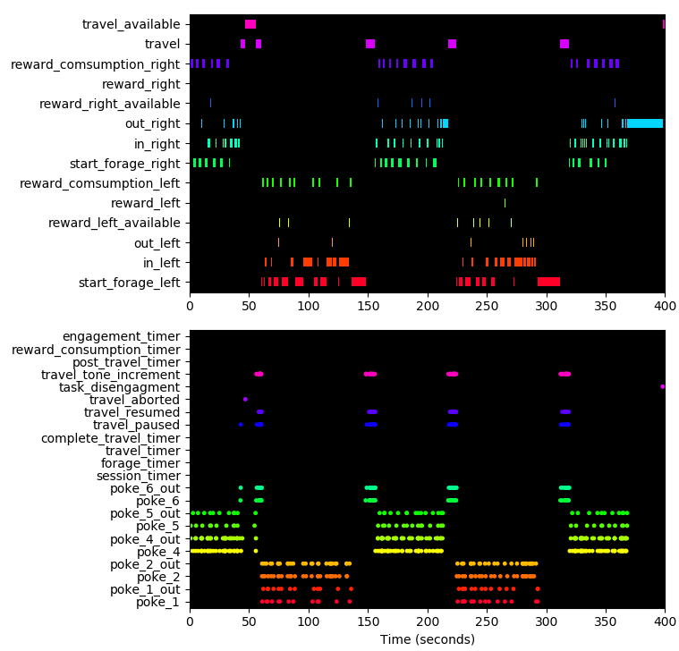

# pyControl data

Log files generated by pyControl experiments are text files whose name is determined by the subject ID, start date and time, e.g. *m001-2018-01-30-214942.txt*

An example data file might read:

```text
I Experiment name  : example_experiment
I Task name : button
I Task file hash : 289826412
I Subject ID : m001
I Start date : 2018/01/30 21:49:42

S {"LED_on": 1, "LED_off": 2}

E {"button_press": 3}

D 0 2
D 8976 3
D 8976 1
P 8976 This is the output of a print statement
D 10162 3
V 10231 variable_name variable_value
D 10423 2
```

Lines beginning `I` contain information about the session including subject, task and experiment names, start date and time.

The single line beginning `S` is a JSON object (also a Python dict) containing the state names and corresponding IDs.

The single line beginning `E` is a JSON object (also a Python dict) containing the event names and corresponding IDs.

Lines beginning `D` are data lines with format `D timestamp ID` where *timestamp* is the time in milliseconds since the start of the framework run and *ID* is a state ID (indicating a state transition) or an event ID (indicating an event occured).

Lines beginning `P` are the output of print statements with format *P timestamp printed_output*. 

Lines beginning `V` indicate the value of a task variable along with a timestamp.  These lines are generated whenever a variable is either set or read from the board by the GUI.  Variables set prior to the task starting are given a timestamp of 0, and the value of summary variables printed at the end of the run are given a timestamp of -1.

Lines beginning `!` indicate that an error occurred during the framework run and contain the error message.

## Analog data

pyControl analog data files (*'.pca'* file extension) are binary data files created by [analog inputs](hardware.md#analog-input) and other source of analog data such as [rotary encoders](hardware.md#rotary-encoder).  They consist of alternating timestamps and data samples, both saved as 4 byte little endian signed integers.  The function `load_analog_data` in the data_import module (see below) loads a pyControl analog data file into Python, returning a numpy array whose first column is timestamps and second column data samples

```python
analog_data_array = load_analog_data('path//to//analog_data_file.pca')
```

## Versioned task files

Task files used to generate data are also stored in the data folder, with a file hash appended to the task file name to uniquely identify the file version.  The file hash of the task file used for each session is recorded in that session's data file so the exact task file version used to run each session can be identified.  We encourage users to treat these versioned task files as part of the experiments' data, and to include them in data repositories to promote replicability of pyControl experiments.

---

## Visualising data

The [session_plot](https://github.com/pyControl/code/blob/master/tools/session_plot.py) module in the *tools* folder contains functions for visualising pyControl data offline.

The session plot module has dependencies:

- Python 3
- numpy
- matplotlib

**Example usage:**

```python
import session_plot as sp # Import the session plot module.

sp.session_plot('path//to//session//file') # Plot a session.

sp.session_plot('path//to//session//file', fig_no=2) # Plot a session in figure 2.

sp.play_session('path//to//session//file') # Scrolling animation of session.

sp.play_session('path//to//session//file', start_time=30) # Scrolling animation of session starting at 30 seconds.
```

**Session plot**



--- 

## Importing data

The [data_import](https://github.com/pyControl/code/blob/master/tools/data_import.py) module in the *tools* folder contains Python classes for importing and representing pyControl data.  A `Session` class represents data from a single session. An `Experiment` class represents data from an experiment consisting of multiple sessions and subjects. A `load_analog_data` function loads analog signals.

The data import module has dependencies:

- Python 3
- numpy

---

### Session

The `Session` class is used to import a pyControl data file and represent it as a Python object.  

**Example usage:**

```python
import data_import as di # Import the data import module.

# Instantiate session object from data file.
session = di.Session('path//to//session//file')

session.events # List of state entries and events in order they occured.  
               # Each item is a namedtuple with fields 'time' & 'name', such that
               # you can get the name and time of event/state entry x with x.name
               # and x.time respectively.

session.times # Dictionary with keys that are the names of the framework events 
              # and states, and values which are Numpy arrays of the times (in
              # milliseconds  since the start of the framework run) at which
              # the event/state entry occured.

session.print_lines # List of all the lines output by print statements during the 
                    # framework run, each line starts with the time in ms
                    # at which it was printed.

```

**Class reference** 

```python
class Session(file_path, int_subject_IDs=True)
```

*Arguments:*

`file_path` Path of the pyControl data file to import.

`int_subject_IDs` If *True*, subject ID is converted to integer, e.g. *'m012'* is converted to *12*.  Otherwise, subject ID is a string.

*Attributes:*

`Session.file_name` Name of data file.

`Session.experiment_name` Name of experiment.

`Session.task_name` Name of the pyControl task used to generate the file.

`Session.subject_ID` ID of subject.

`Session.datetime` The date and time that the session started stored as a [datetime](https://docs.python.org/3/library/datetime.html#datetime-objects) object.

`Session.datetime_string` The date and time that the session started stored as a string of format 'YYYY-MM-DD HH:MM:SS'

`Session.events` List of state entries and events in order they occurred.  Each item is a namedtuple with fields 'time' & 'name', such that you can get the name and time of event/state entry x with x.name and x.time respectively.

`Session.times` Dictionary with keys that are the names of the framework events and states and values which are Numpy arrays of the times (in milliseconds since the start of the framework run) at which the event/state entry occurred.

`Session.print_lines` List of all the lines output by print statements during the framework run, each line starts with the time in milliseconds at which it was printed.


### Experiment

The `Experiment` class is used to import all data files from a given experiment (stored in a single folder) and represent the experiment as a Python object. The experiment class has a method *get_sessions* which can be used to flexibly select sessions from specific subjects and times.

**Example usage:**

```python
import data_import as di # Import the data import module.

# Instantiate experiment object from data folder.
experiment = di.Experiment('path//to//experiment//folder') 

# Save sessions as a .pkl file to speed up subsequent loading of experiment.
experiment.save()

# Return session number 1 for all subjects.
experiment.get_sessions(subject_IDs='all', when=1)

# Return session numbered 1,3 or 5 for all subjects.
experiment.get_sessions(subject_IDs='all', when=[1,3,5]) 

# Return sessions from specified subjects and date.
experiment.get_sessions(subject_IDs=[12,13], when='2017-06-23') 

```

**Class reference** 

```python
class Experiment(folder_path, int_subject_IDs=True)
```

*Arguments:*

`folder_path` Path of the pyControl data folder to import.

`int_subject_IDs` If *True*, subject ID is converted to integer, e.g. *'m012'* is converted to *12*. Otherwise, subject ID is a string.

*Attributes:*

`Experiment.folder_name` Name of the experiment folder.

`Experiment.path` Path of the experiment folder

`Experiment.sessions` List of all sessions in experiment.

`Experiment.subject_IDs` List of all subject IDs

`Experiment.n_subjects` Number of subjects.

*Methods:*

`Experiment.save()`

 Save all sessions as *.pkl* file. Speeds up subsequent instantiation of experiment as sessions do not need to be created from data files.

`Experiment.get_sessions(subject_IDs='all', when='all')`

Returns a list of sessions which match specified subject IDs and time. 

*subject_IDs* argument can be a list of subject IDs or *'all'* to select sessions from all subjects.  

*when* argument determines session numbers or dates to select, see examples below:

```python
when = 'all'      # All sessions
when = 1          # Sessions numbered 1
when = [3,5,8]    # Session numbered 3,5 & 8
when = [...,10]   # Sessions numbered <= 10
when = [5,...]    # Sessions numbered >= 5
when = [5,...,10] # Sessions numbered 5 <= n <= 10
when = '2017-07-07' # Select sessions from date '2017-07-07'
when = ['2017-07-07','2017-07-08'] # Select specified list of dates
when = [...,'2017-07-07'] # Select session with date <= '2017-07-07'
when = ['2017-07-01',...,'2017-07-07'] # Select session with '2017-07-01' <= date <= '2017-07-07'.
```

