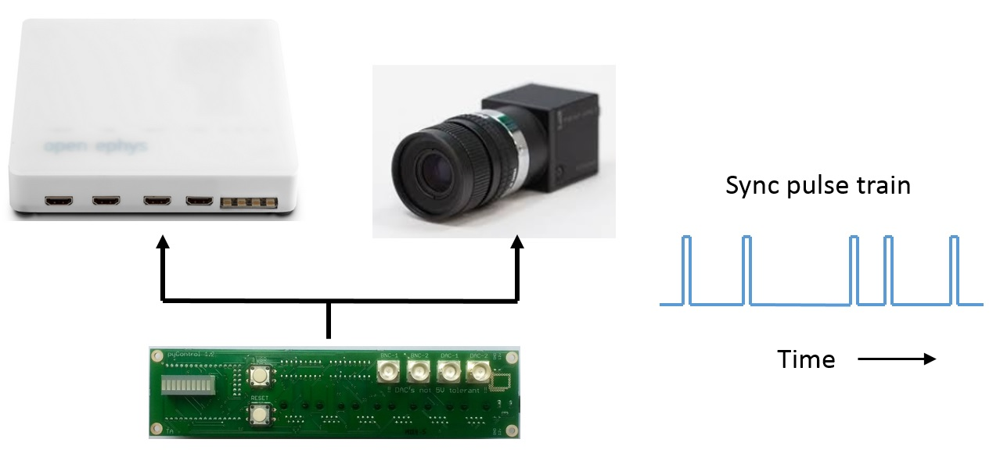
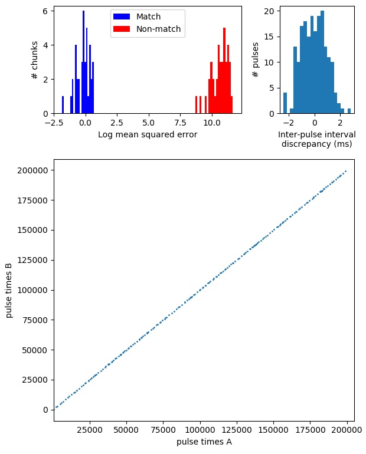

# Synchronisation



Experiments often require synchronising behavioural data with other systems such as video cameras or physiology recordings.  pyControl provides tools for data synchronisation that work by sending synchronisation pulses from pyControl to the other systems which need to be synchronised with it.

The recommended tool for synchronisation is called `Rsync` and works by outputting sync pulse trains with random inter-pulse intervals. The times when sync pulses occurred are recorded by each system in their own time reference frame and can then be used to convert times from one system into the reference frame of another using code provided in the [tools](https://github.com/pyControl/code/tree/master/tools) folder.  The random inter-pulse intervals ensure there is a unique match between the inter-pulse-interval sequences recorded on each system, so it is always possible to identify which pulse corresponds to which even if some pulses are missing, e.g. due to forgetting to turn a system on till after the start of a session.  This also makes it unambiguous whether two files come from the same session in the event of a file name mix-up.

The only functionality a system needs to be synchronised in this way is the ability to record when digital input pulses occurred.  This can be by explicitly storing timestamps, or implicitly, such as camera recording once each frame the state of an input pin (or whether an LED in the field of view is on or off).

Regular sync pulses can also be generated using the `Frame_trigger` class.  This is not as robust to user or hardware error, as if pulses are missing it may not be possible to work out which pulse corresponds to which between systems, but can be useful for working with cameras where frame acquisition can be triggered by external inputs.

## Sync pulse generation

### Rsync

 The `Rsync` object is used to generate sync pulse trains with random inter-pulse intervals.  A single `Rsync` should be used to synchronise all external systems, so that they all receive the same sync pulse train.  This can be achieved physically by outputting the signal on one of the breakout board BNC connectors and using BNC T-junction adapters (e.g. [this](https://cpc.farnell.com/pro-signal/psg08505/connector-bnc-t-50ohm/dp/CN21058)) to split the signal to the different systems. Sync pulse times are recorded in the main pyControl data file using the specified event name.

```python
class Rsync(pin, event_name='rsync', mean_IPI=5000, pulse_dur=50)
```

*Arguments:*

`pin` MicroPython pin to output sync pulses on.

`event_name` Name of the sync pulse events in pyControl data output.

`mean_IPI` Mean interval between sync pulses (milliseconds).  Inter-pulse intervals are drawn from a uniform distribution on the range *0.1\*mean_IPI* to *1.9\*mean_IPI*.

`pulse_dur` Sync pulse duration (milliseconds).

*Example usage:*

```python
sync_output = Rsync(pin=board.BNC_1, mean_IPI=1000) # Instantiate Rsync object on breakout board BNC_1
```

Once an `Rsync` object is instantiated, sync pulses will automatically be generated if the event name specified by the `event_name` argument is included in the tasks events list.

### Frame_trigger

The `Frame_trigger` object is used to generate regular pulse trains at a specified frequency, and is designed for triggering camera frame acquisition or similar applications.  The pulse train is a square wave with a 50% duty cycle and is output continuously while the framework is running.  The time of pulse rising edges and corresponding pulse numbers are saved as a seperate pyControl [analog data](pycontrol-data.md#analog-data) file (.pca file).

```python
class Frame_trigger(pin, pulse_rate, name='frame_trigger')
```

Arguments:

`pin` The pin to output pulses on.

`pulse_rate` The rate in Hz of the output pulse train.

`name` Name of the Frame_trigger object used to identify the datafile.

*Example usage:*

```python
frame_trigger = Frame_trigger(pin=board.BNC_2, pulse_rate=60) # Instantiate Frame_trigger on breakout board BNC_2
```

## Synchronising data

The [rsync](https://github.com/pyControl/code/blob/master/tools/rsync.py) module in the tools folder can be used in Python to convert event times from one hardware system's reference frame that of another system by using sync pulse times generated by the `Rsync` object recorded on both systems.  To illustrate this, assume we have an array of sync pulse times recorded by pyControl called `pulse_times_pycontrol` and an array of sync pulse times recorded by an ephys system called `pulse_times_ephys`.  We also have an array of spike times recorded by the ephys system called `spike_times_ephys` which we want to convert into the reference frame of the pyControl data.  We first instantiate an *Rsync_aligner* object using the pulse times recorded by both systems:

```python
from rsync import Rsync_aligner

ephys_aligner = Rsync_aligner(
    pulse_times_A=pulse_times_pycontrol,
    pulse_times_B=pulse_times_ephys,
)
```

We can then convert the spike times recorded by the ephys system into the pyControl data's time reference frame using:

```python
spike_times_pycontrol = ephys_aligner.B_to_A(spike_times_ephys)
```

We could also convert an array of pyControl event times into the reference frame of the ephys data using:

```python
event_times_ephys = ephys_aligner.A_to_B(event_times_pycontrol)
```

To work out which pulses correspond to which in the two sequences, the alignment code needs to know the relative units the two sets of pulse times are recorded in.   For example, imagine we want to synchronise a camera which acquires frames at 60Hz with pyControl data, using an array called `pulse_frame_numbers` specifying the frame numbers when sync pulses occurred.  The pyControl pulse times are in units of ms whereas the `pulse_frame_numbers` are in units of 1000/60 = 16.67ms.  By default, the alignment code will automatically estimate the relative units from the pulse trains themselves.  Alternatively you can explicitly specify the units for each pulse sequence in ms:

```python
camera_aligner = Rsync_aligner(
    pulse_times_A=pulse_times_pycontrol,
    pulse_times_B=pulse_frame_numbers,
    units_A=1,
    units_B=1000 / 60,
)
```

Automatic detection of the units convenient but may fail to find a match between the pulse sequences if you have too few sync pulses to accurately estimate the mean inter-pulse interval. Specifying the units manually can also be a good sanity check to make sure the data are as expected, for example if the camera was actually acquiring frames at 100Hz rather than 60Hz, the error would be detected when specifying units manually because the sync code would not find a match between the pulse sequences.

We can then convert the frame numbers when an event of interest occurred into the pyControl data's time reference frame using:

```python
frame_times_pycontrol = camera_aligner.B_to_A(video_frame_numbers)
```

We can also convert the times when a pyControl event occurred into the corresponding camera frame numbers:

```pyton
event_frame_numbers = camera_aligner.A_to_B(event_times_pycontrol)
```

An example analysis showing how to synchronise pyControl behavioural data with neural activity recorded using [pyPhotometry](https://pyphotometry.readthedocs.io/en/latest/) is provided in this [data synchronisation](https://github.com/ThomasAkam/data_synchronisation/blob/master/data_synchronisation.ipynb) jupyter notebook.

---

## Rsync_aligner class reference

```python 
class Rsync_aligner(pulse_times_A, pulse_times_B, units_A='auto', units_B='auto', 
            chunk_size=5, plot=False, raise_exception=True)
```

*Arguments:*

`pulse_times_A` The times when sync pulses occurred recorded by hardware system A.

`pulse_times_B` The times when sync pulses occurred recorded by hardware system B.

`units_A` The time units used by system A expressed in milliseconds.  E.g. if system A uses units of seconds the *units_A* argument is 1000.  If either `units_A` or `units_B` is set to the default value of `'auto'` the code will automatically estimate the relative units for the two sequences from the pulse times themselves.

`units_B` The time units used by system B expressed in milliseconds.

`chunk_size` The length of pulse sequence chunks used for alignment, see below.

`plot` Whether to plot information about the alignment.

`raise_exception` If *True* an *RsyncError* exception is raised if no match is found between the sync pulse sequences.  If *False* an error message is printed but no exception is raised.

*Methods:*

```python 
Rsync_aligner.A_to_B(event_times_A)
```
Convert a set of event times recorded by system A into the time reference frame of system B.

```python 
Rsync_aligner.B_to_A(event_times_B)
```
Convert a set of event times recorded by system B into the time reference frame of system A.

*Implementation:*

When the aligner is instantiated it works out which pulses from each system correspond to each other by taking short chunks of pulse sequence A and finding the corresponding chunks of pulse sequence B which minimise the mean squared error between the inter-pulse intervals.  As the alignment is performed on short chunks rather than the whole sequence, it is robust against missing pulses on one or both systems even if they occur part way through a recording.  

After finding for each chunk the match which minimises the mean squared error, the aligner determines a mean-squared error threshold which separates chunks that have a corresponding match in the other sequence from chunks that do not have a match (due to missing pulses).  The threshold is found by fitting a mixture of Gaussians to the distribution of log mean squared errors from both the best matches and second best matches for all chunks.  This distribution should have two well separated peaks, one containing correct matches and the other non-matches.

The *A_to_B* and *B_to_A* methods convert event times from the reference frame of one system to that of the other by linearly interpolating between sync pulse times on either side of the event.  These functions return *NaNs* for any event time where the sync pulses on either side of the event do not have a match in the pulse sequence recorded on the other system.

If the *plot* argument is set to *True* when the aligner is instantiated, the following plots are generated:



The top left panel shows the distribution of log mean squared error for the best and second best matches for all chunks, with colour indicating which are identified as matches and which non-matches.  The top right panel shows the distribution of discrepancies between inter-pulse intervals recorded on the two systems. The bottom panel plots pulse times recorded by system A against corresponding pulse times recorded by system B.